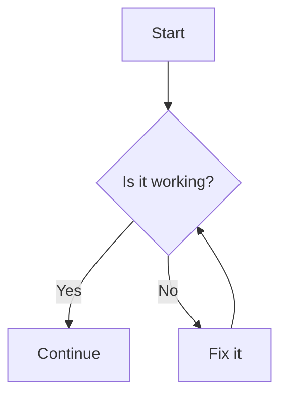
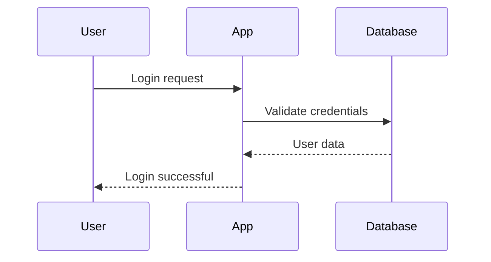
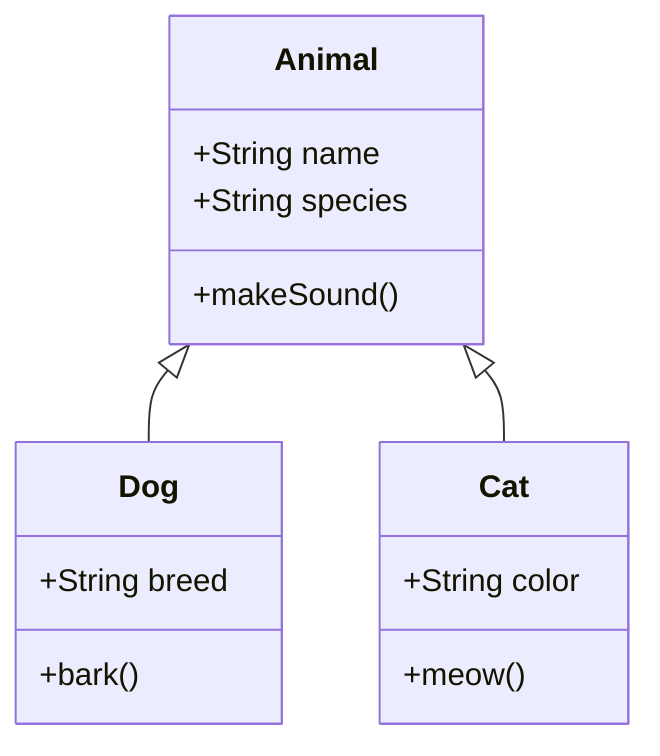
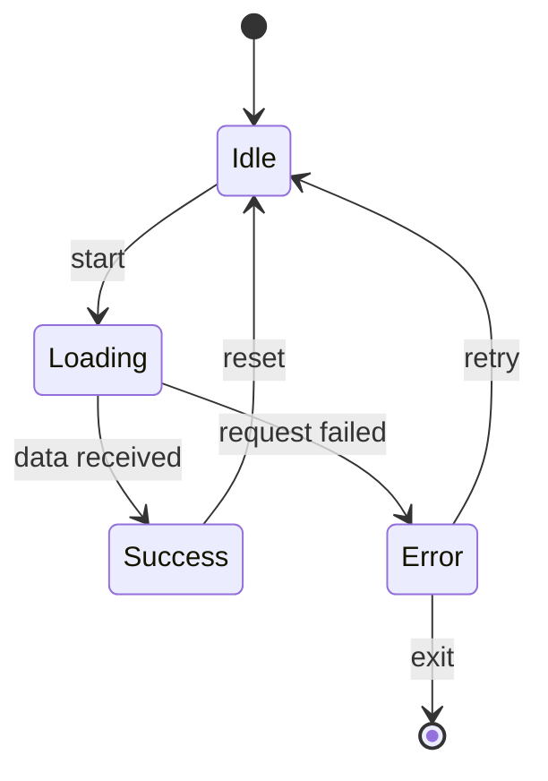
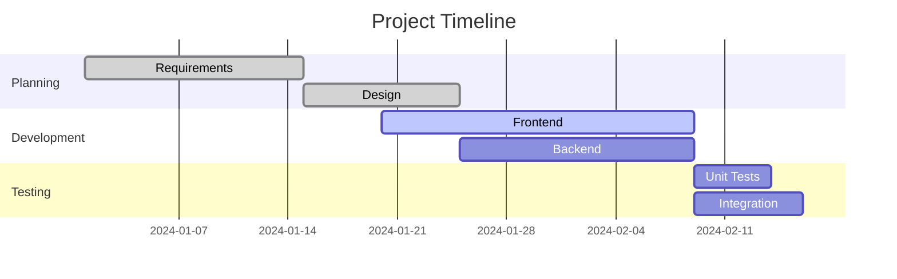

# Mermaid Examples

This repository contains examples of [Mermaid](https://mermaid.js.org/) diagrams. Mermaid is a JavaScript-based diagramming and charting tool that uses Markdown-inspired text definitions to create and modify diagrams dynamically.

## What is Mermaid?

Mermaid allows you to create diagrams and visualizations using text and code. It's widely supported in documentation platforms like GitHub, GitLab, and many static site generators.

## Examples

### Flowchart

Basic flowchart showing a simple decision process:



### Sequence Diagram

Shows interactions between different actors over time:



### Git Graph

Visualizes git branching and merging:

```mermaid
gitgraph
    commit
    commit
    branch develop
    checkout develop
    commit
    commit
    checkout main
    merge develop
    commit
```

### Class Diagram

Shows relationships between classes:



### State Diagram

Represents state transitions:



### Gantt Chart

Project timeline visualization:



## How to Use

1. **In GitHub/GitLab**: Simply add mermaid code blocks in your markdown files
2. **In VS Code**: Install the "Mermaid Preview" extension
3. **In documentation sites**: Most modern static site generators support Mermaid
4. **Online**: Use the [Mermaid Live Editor](https://mermaid.live) to create and test diagrams

## Syntax Resources

- [Official Mermaid Documentation](https://mermaid.js.org/)
- [Flowchart Syntax](https://mermaid.js.org/syntax/flowchart.html)
- [Sequence Diagram Syntax](https://mermaid.js.org/syntax/sequenceDiagram.html)
- [Class Diagram Syntax](https://mermaid.js.org/syntax/classDiagram.html)
- [State Diagram Syntax](https://mermaid.js.org/syntax/stateDiagram.html)
- [Gantt Chart Syntax](https://mermaid.js.org/syntax/gantt.html)

## Tips

- Use meaningful names for nodes and connections
- Keep diagrams simple and focused
- Use consistent styling and naming conventions
- Test your diagrams in the Mermaid Live Editor before committing
- Consider the audience when choosing diagram types

## Contributing

Feel free to add more examples or improve existing ones. Make sure to:
- Test diagrams before submitting
- Add clear descriptions for complex diagrams
- Follow the existing structure and formatting