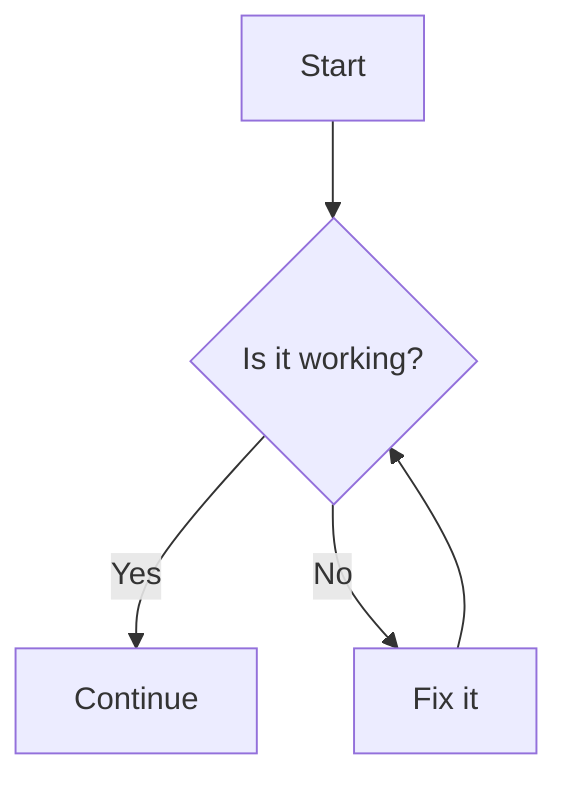
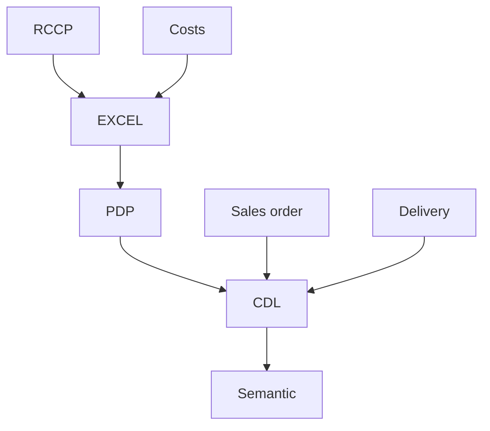

# mermaidexamples
Examples of mermaid

```mermaid
flowchart TD
    A[Start] --> B{Is it working?}
    B -- Yes --> C[Continue]
    B -- No --> D[Fix it]
    D --> B
```

```mermaid
flowchart TD
    A[RCCP] --> B[EXCEL]
    B --> C[PDP]
    C --> D[CDL]
    D --> S[Semantic]
    E[Costs] --> B
    F[Sales order]--> D
    G[Delivery] --> D


```
